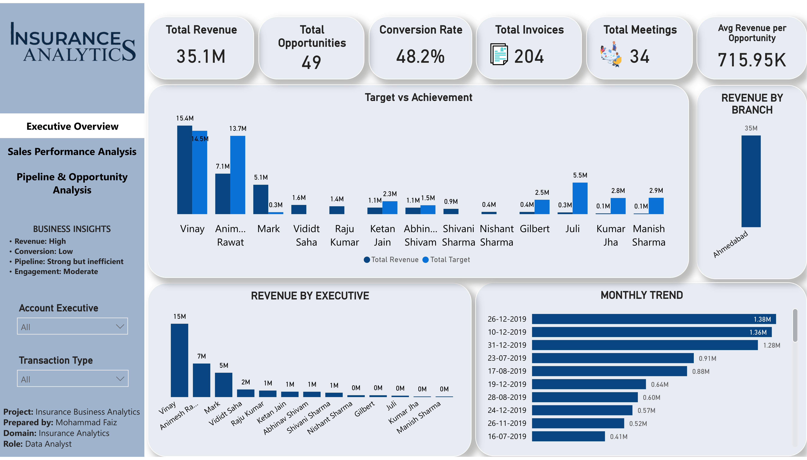
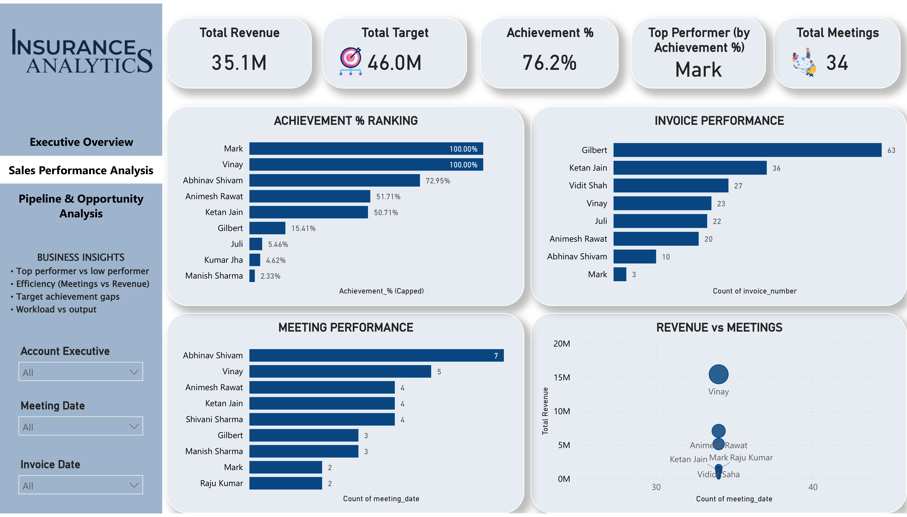
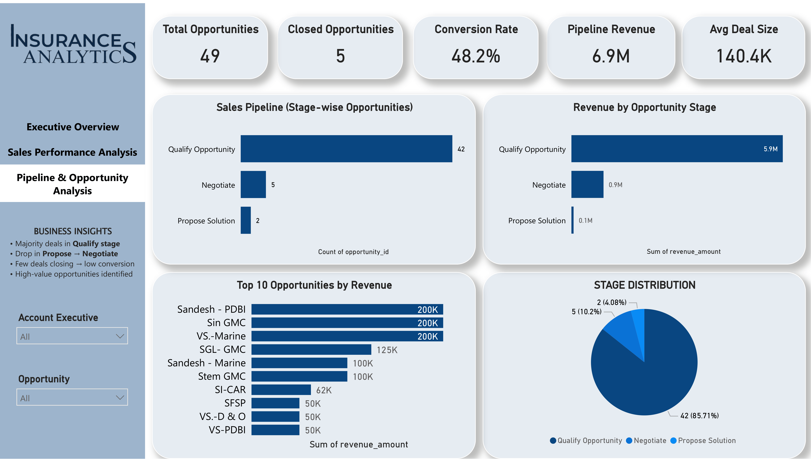

# 📊 Interactive Power BI Dashboard

Click any of the dashboard previews below to open the **live interactive report**.

### 1️⃣ Executive Overview

### 2️⃣ Sales Performance Analysis

### 3️⃣ Pipeline & Opportunity Analysis

---
**💡 Pro Tip:** Use the slicers on the left side of the live report to filter data by **Account Executive** or **Branch**.

**Note:** If the images don't load, [click here to view the full report](https://app.powerbi.com/view?r=eyJrIjoiMjU0YTMwNGQtY2Q2ZC00ZDc5LTljNDQtYTA0NzEyOWQwMjM1IiwidCI6IjVkZjVlYWI0LWMzZGUtNDRlMC1iNTI2LTBkOGNiNTU1MmNhZCJ9).